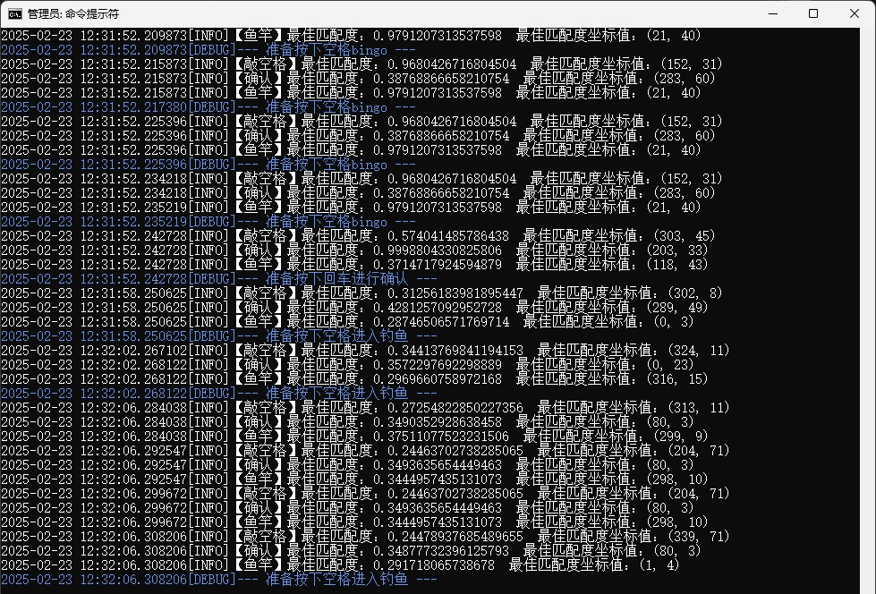

# PopKartFishing

PopKartFishing/跑跑卡丁车钓鱼

简易的、基于opencv-python图像识别的 自动化钓鱼工具

**请务必以管理员权限新建cmd窗口，执行fishing.py，让脚本有权限与句柄交互**

**请务必以管理员权限新建cmd窗口，执行fishing.py，让脚本有权限与句柄交互**

**请务必以管理员权限新建cmd窗口，执行fishing.py，让脚本有权限与句柄交互**

Q：环境准备？

A：Python > 3.8  大概吧  and  安装`requirements.txt`指定三方库

Q：脚本在客户端处于哪个界面时启动？

A：如图


Q：怎么确定代码中`self.dimensions`范围

A：如图，截图工具大致框住钓鱼触发区域即可

注意：同时请考虑框选区域能看见结束钓鱼的`确定`按钮，用以识别键入回车


示例中对应dimensions取值：

```python
self.dimensions = {
    'left': 695,
    'top': 872,
    'width': 513,
    'height': 93
}
```

Q：运行示例？

A：如图


